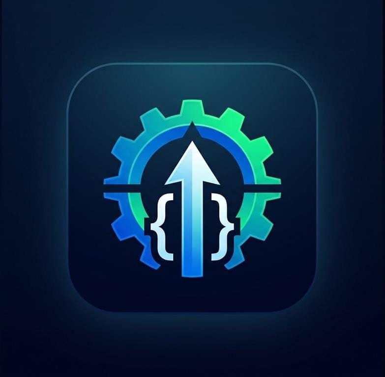

<p align="center">
  
</p>

<h1 align="center">⚡ Productivity Agent</h1>

<p align="center">
  <strong>A pure classical & autonomous cybernetic AI productivity agent built from scratch.</strong><br/>
  Zero Third-Party LLMs &bull; Zero Cloud APIs &bull; 100% Deterministic &bull; 24/7 Autonomous Lockdown
</p>

<p align="center">
  
  
  
  
  
  
</p>

---

## 🧭 Core Philosophy

Modern productivity apps rely heavily on third-party cloud LLMs, recurring subscription models, and opaque black boxes that introduce network latency, hallucinations, and privacy leaks.

**Productivity Agent** takes a classical AI & cybernetics approach:
* **Zero External AI Services**: No OpenAI, Anthropic, TensorFlow, or PyTorch. Decision-making is executed entirely through deterministic expert systems, finite state machines (FSM), and localized heuristic scoring.
* **Instantaneous Response (0ms Latency)**: Runs completely on-device without cloud network roundtrips.
* **Continuous 24/7 Autonomous Lockdown**: No manual "focus timers" or pause buttons. Once installed and granted permissions, protection is permanently active with zero temptation to disable it.
* **100% Privacy Preserved**: All audit trails, telemetry, and decision scoring remain strictly on the local machine and device.

---

## ⚡ Key Features

### 1. 24/7 Continuous Autonomous Guardian
* **Zero Manual Session Controls**: Completely eliminates manual start/stop buttons and duration selectors (`25m`, `45m`, `60m`).
* **Permanent Focus Enforcement**: The agent defaults to active lockdown. Productive activities (DSA problem solving, courses, research, work) are unrestricted, while distraction channels are strictly regulated.
* **Cyber Shield HUD**: Mobile companion interface displays a live, pulsing neon cyber shield with real-time active window telemetry and quota balances.

### 2. 3-Window Daily Entertainment Quotas (60m Max)
Short-form video feeds (Instagram Reels, YouTube Shorts) are capped at **60 minutes per day**, distributed across three non-transferable 20-minute windows:

| Window | Time Span | Window Quota | Behavior When Exhausted |
| :--- | :--- | :--- | :--- |
| 🌅 **Morning** | `06:00 – 12:00` | **20 minutes** | Kicked to Home screen immediately upon opening Reels/Shorts |
| ☀️ **Afternoon** | `12:00 – 18:00` | **20 minutes** | Fresh 20m budget opens; morning quota does not roll over |
| 🌙 **Evening** | `18:00 – 24:00` | **20 minutes** | Final 20m evening wind-down allocation |
| 🛑 **Night Locked** | `00:00 – 06:00` | **0 minutes** | Hard-locked (zero tolerance during sleep hours) |

* **Strict Isolation**: Unused minutes from one window cannot roll over to subsequent windows.
* **Atomic Midnight Reset**: Quota consumption is persisted in `SharedPreferences` in real-time and resets automatically at midnight.

### 3. Content Intelligence Engine (Semantic Interception)
* **Real-Time Content Discrimination**: Inspects accessibility hierarchy text and metadata inside YouTube and web browsers (Chrome, Brave, Firefox, Edge, etc.).
* **Productive Content (Instant Allow)**: DSA, algorithms, LeetCode, Codeforces, computer science, system design, university lectures, physics, mathematics, and tutorials are granted unrestricted access.
* **Unproductive Content (12s Auto-Kick)**: Pranks, comedy roasts, reaction videos, unboxing, celebrity gossip, and gaming streams trigger a floating 12-second countdown overlay (`ProductivityWarningOverlay`):
  > **⚠️ Unproductive Content Detected**  
  > *Navigate to productive content or this app will close.*  
  > **Closing in 12s...**
* **Instant Redirection**: Navigating back to productive content immediately dismisses the warning. If the countdown expires, the user is forcibly kicked to the Android Home screen.

### 4. Zero-Tolerance Hard Blocks
* Instant block upon launch for non-productive messaging (Telegram), video streaming (Netflix, Prime Video, Disney+, Hotstar), and music apps (Spotify, YouTube Music, Apple Music, JioSaavn).

---

## 🏛️ System Architecture

```
┌────────────────────────────────────────────────────────────────────────┐
│                        Flutter Mobile Companion                        │
│   • Cyberpunk OLED Theme (Deep Black #07080D, Neon Emerald, Cyan)      │
│   • 24/7 Autonomous Lockdown HUD & Active Window Status Ring          │
│   • 3-Window Live Entertainment Quota Cards (Morning / Afternoon / Eve)│
│   • Restricted Package Management & Diagnostic Overlays               │
└───────────────────────────────────┬────────────────────────────────────┘
                                    │ MethodChannel & EventChannel
┌───────────────────────────────────▼────────────────────────────────────┐
│                    Android Native Layer (Kotlin)                       │
│                                                                        │
│  • MyAccessibilityService:                                             │
│      - Real-time window state & content changed event interception     │
│      - Instant kickToHome() (GLOBAL_ACTION_HOME) on infractions        │
│  • ContentIntelligenceEngine:                                          │
│      - Semantic scoring of on-screen titles, descriptions, and classes │
│  • ContentGraceMonitor & ProductivityWarningOverlay:                   │
│      - 12-second visible countdown overlay for unproductive media      │
│  • AutonomousQuotaManager:                                             │
│      - 3-window budget tracking & atomic midnight reset                │
└────────────────────────────────────────────────────────────────────────┘
                                    │
┌───────────────────────────────────▼────────────────────────────────────┐
│                     Python Core Cybernetic Engine                      │
│                                                                        │
│  • Perception Layer  → Window tracker & screentime monitor             │
│  • Event Pipeline    → 5-stage sequential event processing             │
│  • State Machine     → Finite State Machine (Idle, Deep Focus, Breaks) │
│  • Hybrid Rule Engine→ Quota evaluator & strict policy enforcer        │
│  • Persistent Memory → SQLite event audit trails & daily summaries     │
└────────────────────────────────────────────────────────────────────────┘
```

---

## 📁 Repository Structure

```
productivity-agent/
├── core/                               # Python Classical Engine
│   ├── contracts.py                    # Event definitions & macro states
│   ├── fsm.py                          # Finite State Machine implementation
│   ├── perception.py                   # Window perception & screentime tracker
│   ├── pipeline.py                     # 5-stage event processing pipeline
│   ├── database.py                     # SQLite memory & event audit trail
│   └── heartbeat.py                    # Periodic autonomous daemon
├── rules/                              # Deterministic Rule Engine
│   └── engine.py                       # Hard rules & quota constraint evaluator
├── actuators/                          # Action Execution
│   └── console.py                      # Local console chimes & notification alerts
├── mobile/                             # Flutter Android Companion
│   ├── android/app/src/main/kotlin/com/syedafridi/productivity_agent/
│   │   ├── services/
│   │   │   ├── AutonomousQuotaManager.kt    # 3-window quota manager
│   │   │   ├── ContentIntelligenceEngine.kt # Semantic content classifier
│   │   │   ├── ContentGraceMonitor.kt       # Grace period monitor
│   │   │   ├── MyAccessibilityService.kt    # Android accessibility service
│   │   │   └── SubScreenClassifier.kt       # Sub-screen filter
│   │   ├── ui/
│   │   │   └── ProductivityWarningOverlay.kt# 12-second countdown overlay
│   │   └── MainActivity.kt                  # Flutter-Kotlin Bridge
│   ├── lib/
│   │   ├── models/agent_status.dart         # Status & Window models
│   │   ├── controllers/agent_controller.dart# Reactive state controller
│   │   ├── screens/dashboard_screen.dart    # 24/7 Guardian HUD & Quota cards
│   │   ├── screens/settings_screen.dart     # System permissions & package rules
│   │   └── widgets/status_ring.dart         # Neon Cyber Shield widget
│   └── test/                                # Flutter Unit & Widget tests
├── tests/                              # Python Engine Test Suite (61 tests)
├── logo.jpeg                           # Application logo
├── main.py                             # Interactive CLI simulator
└── README.md                           # Documentation
```

---

## 🚀 Quick Start

### 1. Python Core Simulator

#### Prerequisites
* Python 3.10+ (Standard library only; **no external packages required**)

#### Launch CLI Simulator
```bash
python main.py
```

#### Available CLI Commands
| Command | Description | Example |
| :--- | :--- | :--- |
| `status` | View current state, active app, timers, and daily metrics | `status` |
| `focus [min]` | Start a Deep Focus session | `focus 25` |
| `break [min]` | Start a short break session | `break 5` |
| `stop` | Stop active focus session | `stop` |
| `app <pkg>` | Simulate opening an application | `app com.instagram.android` |
| `screen <on\|off>` | Simulate phone screen toggles | `screen off` |
| `tick [sec]` | Fast-forward simulated time | `tick 300` |
| `violations` | View recorded infractions today | `violations` |
| `summary` | Generate daily focus & distraction report | `summary` |
| `rules` | Inspect active rules and app blocklists | `rules` |
| `quit` | Gracefully terminate all threads and exit | `quit` |

---

### 2. Mobile Companion App (Flutter + Android)

#### Prerequisites
* Flutter SDK (3.x+)
* Android SDK & Gradle

#### Run Test Suites
```bash
# 1. Run Flutter unit & widget tests
cd mobile
flutter test

# 2. Run Android Native JVM unit tests
cd android
.\gradlew testDebugUnitTest --no-daemon
```

#### Build & Install on Device
```bash
# 1. Build the debug APK
cd mobile
flutter build apk --debug

# 2. Connect device via Wireless ADB or USB
adb connect <PHONE_IP>:<PORT>

# 3. Install the APK
adb install -r -d build/app/outputs/flutter-apk/app-debug.apk
```

> **Note**: After installation, grant the **Productivity Agent Accessibility Service** and **Display over other apps** permissions in Android Settings. The 24/7 Autonomous Guardian will immediately begin background enforcement.

---

## 🧪 Automated Test Suite Verification

The codebase is protected by automated tests across all layers:

| Layer | Framework | Scope | Result |
| :--- | :--- | :--- | :--- |
| **Android Native (JVM)** | JUnit 4 / Gradle | `AutonomousQuotaManagerTest`, `ContentIntelligenceEngineTest`, `ContentGraceMonitorTest`, etc. | **BUILD SUCCESSFUL** (35 tasks) |
| **Flutter Companion** | `flutter_test` | `quota_dashboard_test.dart`, `widget_test.dart`, `controller_test.dart`, `agent_status_test.dart`, etc. | **32/32 PASSED** (100%) |
| **Python Core Engine** | `unittest` | `test_fsm.py`, `test_screentime.py`, `test_interceptor.py`, `test_config.py`, etc. | **61/61 PASSED** (100%) |
| **Total Automated Tests** | &mdash; | **128+ tests** covering all platforms | **100% GREEN** |

---

## 📜 License

This project is licensed under the [MIT License](LICENSE).
